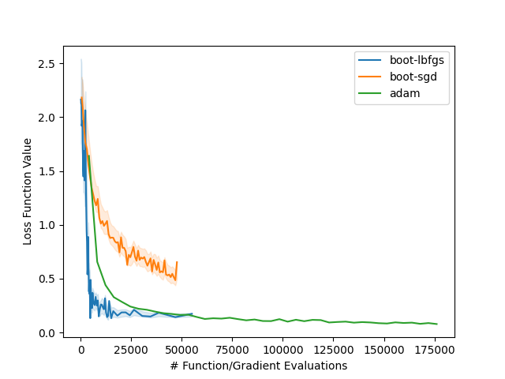

boots
=====

Summary
-------

The `boots` repository is an experimental implementation of an idea for mini-batch first order optimziation algorithms (Gradient Descent, L-BFGS) for optimizing stochastic loss functions.
We combine the standard algorithms for Gradient Descent and L-BFGS with [bootstrap sampling](https://en.wikipedia.org/wiki/Bootstrapping_(statistics)) of mini-batches of the training dataset to:

  1. Remove the sampling *bias* from the computed function/gradient values
  2. Estimate the standard error of the function/gradient values to use as additional convergence criteria in a [Strong Wolfe line search](https://en.wikipedia.org/wiki/Wolfe_conditions)

The algorithm was implemented in [tensorflow](https://www.tensorflow.org/) and tested by training a small (toy) convolutional neural network with 4,282 parameters, and the convergence was observed as a function of the number of function evaluations. The [results](#Results) below show that the convergence of the bootstrapped L-BFGS algorithm can be comparable to [ADAM](https://arxiv.org/abs/1412.6980) up to several epochs, measured by the decrease in training loss achieved per cumulative per-sample function/gradient evaluations.

Background
-----------

We consider a loss function $f(w)$ parameterized by $N$-dimensional *weight* vector $w$ over a dataset $\{(x_{i}, y_{i})\}$ of (observation, response) pairs that is evaluated as the average of the loss $L$ evaluated for each sample:

$$ f(w) = \frac{1}{n} \sum_{i}^{n} L(x_{i}, y_{i}|w) $$

In our use case, the function $L$ is some measurement of goodness of fit of a predictive model $M(w)$ parameterized by $w$.
For example, in a regression setting we may consider the least squared error in the prediction, and our loss $f(w)$ would be the following:

$$ f(w) = \frac{1}{n} \sum_{i}^{n} (M(x_{i}|w) - y_{i})^2 $$

In unconstrained optimization of functions, first order optimizers use a [line search](https://en.wikipedia.org/wiki/Line_search) in each iteration to minimize $f$ along a chosen search direction; that is, in each iteration to determine an approximate solution to the univariate problem

$$ \alpha^{\*} = \arg \min_{\alpha} f(w + \alpha p)$$

where $w$ and $p$ are fixed.
The convergence properties (i.e. the secret sauce) of the optimizer depends on the *selection* of search direction $p$ in each iteration, after which the line search is a workhorse component of the routine that ensures that the Wolfe conditions of (1) sufficient decrease and (2) suitable curvature are satisfied.

In stochastic optimization techniques, rather than evaluate the function $f$ and its gradient $\nabla f$ for *every* record $\{(x_{i}, y_{i})\}$, approximate values are computed instead by randomly sampling a subset of records, and then applying line-search-ish updates along the approximate steepest descent direction.
In this parameter update, the step size is determined by a fixed decay function in each iteration, rather than a solution to a line search problem.

We apply the same idea here, and rather than evaluate the loss function $f(w)$ by using every record in the training dataset, instead use mini-batches (data subsets) on the order of $1,000$ samples to estimate $f$ and $\nabla f$ with bootstrap sampling.
The bootstrap resampling process is also used to estimate the unbiased values of the batch function and gradient, and estimate the errors in their values as additional *uncertainty* criteria in line search along the descent directions.

Algorithm
---------

The bootstrap-sampled first order optimizer works as follows:

#### **Inputs:**

  - A stochastic loss function $f(w)$ with a per-sample function $L(x_{i}, y_{i}|w)$ to evaluate over a dataset $D = \{(x_{i}, y_{i})\}$
  - A sampling mini-batch size, $b$ (roughly $2^{10}$ samples)
  - The number of bootstraps to compute, $B$ (roughly $2^{10}$ draws)
  - An initial guess for the paramters, $w_0$

#### **Iteration:**

- **For iteration $k = 1, 2, 3, ...$ until converged, do:**

  - Draw $b$ samples *without replacement* from $D$ to create a mini-batch dataset $\hat{D_k}$
  - Construct the subsampled loss function $\hat{f}_{k}(w)$ as:

     $$ \hat{f_k} (w) = \frac{1}{b} \sum_{(x_{i}, y_{i}) \in \hat{D_k} } L( x_{i}, y_{i}|w) $$

  - Choose a descent direction $p_{k}$ based on the optimizer algorithm;

    - For Gradient Descent, $p_{k} = -\nabla \hat{f_k}$
    - For L-BFGS, compute the descent direction using the approximate inverse Hessian from the [BFGS recusion](https://en.wikipedia.org/wiki/Limited-memory_BFGS) formula based on previous iterates ${w_{k-1}, w_{k-2}, ...}$ and approximate gradients ${\nabla \hat{f_{k-1}}, \nabla \hat{f_{k-2}}, ...}$

  - Perform a bootstrap-modified Strong Wolfe line search along the direction $p_{k}$ to solve the subproblem:

    $$ \alpha_{k}^{\*} = \arg \min_{\alpha} \hat{f_k} (w_{k-1} + \alpha p_k)$$

  - **Restart**: If the line search fails to determine a suitable $\alpha_{k}^{\*}$ and $p_{k} \neq -\nabla \hat{f_k}$, then reset the search vector to the steepest descent direction; set $p_{k} = -\nabla \hat{f_k}$ and recompute $\alpha_{k}^{\*}$

  - Set $w_{k} = w_{k-1} + \alpha^{\*}_{k} p_{k}$

### Bootstrapped Line Search

We use a modified version of the Strong Wolfe line search algorithm described in Wright and Nocedal, *Numerical Optimization*, 1999, pp. 59-61, in which a step size is considered acceptable if it meets a probabilistic version of the Strong Wolfe conditions.

For each evaluation of the subsampled function $\hat{f}$ and its gradient $\nabla \hat{f}$, we use $B$ bootstrap draws to estimate:

  1. The sampling bias $\delta$ of the function $f(w)$ (which, as an empirical mean over the dataset $D$ is itself an approximation to some *true* loss function value if it could be evaluated over all possible observations in the universe that $D$ is drawn from)
  2. The standard error $\delta \hat{f}$ of the function $\hat{f}(w)$, such that we may consider the mini-batch loss function values as measurements with uncertainty, $\hat{f} \pm \delta \hat{f}$
  2. The component-wise standard errors $\delta \nabla \hat{f}$ of the gradient $\nabla \hat{f}(w)$, such that the gradient vector may also be considered as a vector of measurements with uncertainty, $\nabla \hat{f} \pm \delta \nabla \hat{f}$ 

By factoring in the bias subtraction, our line search is used to solve the modified problem, in which the $\delta \hat{f_k}$ is re-computed for each candidate value of $\alpha$:

$$ \alpha_{k}^{\*} = \arg \min_{\alpha} \hat{f_k} (w_{k-1} + \alpha p_k) - \delta \hat{f_k}(w_{k-1} + \alpha p_k) $$

In each iteration of the line search, if a point satisfying the standard Wolfe conditions is found, we then conduct a [2-sample t-test](https://en.wikipedia.org/wiki/Welch%27s_t-test) for the Strong Wolfe conditions using the standard errors of the values computed by the bootstrap sample to propagate uncertainties in the calculations using [standard formulas](https://en.wikipedia.org/wiki/Propagation_of_uncertainty).
This step is intended to extend the typical Wolfe formulas to work as intended even in the presence of measurement uncertainties and sampling errors, and avoid a situation in which poorly sampled mini-batches degrade the solver performance by inducing parameter updates that based on a loss function that is not statistically representative of the full training dataset.

Implementation
---------------
We implemented the algorithm above in `python` using the `tensorflow` library for defining the model and loss functions, and ``scipy.stats`` and ``scipy.optimize`` routines for the linesearch and bootstrapping calculations.

The implementation has the following components:

- [``BootstrapOptimizedModel``](https://github.com/mbhynes/boots/blob/8adfee0ab6c4023be6e79563220710b75ac7537d/boots/models.py#L152) 
  - This class extends the ``keras.Model`` interface and provides the highest level entry point for users to call by handling the parameter optimization with its ``optimizer`` attribute, where the ``optimizer`` is an instance of a ``BootstrappedFirstOrderOptimizer``
  - The class overrides the default ``keras.Model.train_step()`` method and calls the ``optimizer.iterate()`` method, which performs an iteration of the optimization algorithm
  - Each call to ``iterate()`` requires a callable providing the $b$-dimensional loss function vector (that is, the loss for each of the individual $b$ samples in the mini-batch) and $(b \times N)$-dimensional matrix of stacked $N$-dimensional gradient vectors for each sample
    - This callable is wrapped in a `tensorflow.function` and provides the function/gradient through a tensorflow [``GradientTape.jacobian``](https://www.tensorflow.org/api_docs/python/tf/GradientTape#jacobian) through the private method [``_fg``](https://github.com/mbhynes/boots/blob/10774d4a88ed655cbbf8ab4c619791fad0b527f6/boots/models.py#L233)
    - Computing the Jacobian is really slow and memory intensive---in fact to compute the Jacobian robustly on large models with the batch sizes on the order of $2^{10}$ we found it necessary to split the mini-batch into chunks of less than $2^5$ samples, accumulate the values in a [TensorArray](https://www.tensorflow.org/api_docs/python/tf/TensorArray), and then concatenate the intermediary results. As an aside, there have been discussions for years about how to compute Jacobians in tensorflow (e.g. [tensorflow#4897](https://github.com/tensorflow/tensorflow/issues/4897), [tensorflow#675](https://github.com/tensorflow/tensorflow/issues/675)), and it is known that this an atypical use case not efficiently handled by a reverse-mode autodifferentiation system.
  - Please note that during training this model performs conversions between the [``tensorflow.Tensor``](https://www.tensorflow.org/api_docs/python/tf/Tensor) (2-dimensional) representations of the model weights and their stacked (1-dimensional) [``numpy.ndarray``](https://numpy.org/doc/stable/reference/generated/numpy.ndarray.html) representation each time the function/gradient is evaluated on a mini-batch, since we've used a prebuild line search in `scipy` rather than implement one natively in `tensorflow` for a simple prototype.

- [``BootstrappedFirstOrderOptimizer``](https://github.com/mbhynes/boots/blob/8adfee0ab6c4023be6e79563220710b75ac7537d/boots/optimizers.py#L333)
  - This class is responsible for implementing a first order optimization routine like Gradient Descent or L-BFGS by providing an ``iterate()`` method that performs 1 iteration of the algorithm and updates the state of the solver. Please note ``iterate()`` is called *externally* by a ``BootstrapOptimizedModel`` instance and the optimizer state is persistent between successive ``iterate()`` calls to be congruous with the `keras.Model` training procedure.
  - Implementations of specific solvers (e.g. [``GradientDescentOptimizer``](https://github.com/mbhynes/boots/blob/8adfee0ab6c4023be6e79563220710b75ac7537d/boots/optimizers.py#L465) and [``LbfgsOptimizer``](https://github.com/mbhynes/boots/blob/8adfee0ab6c4023be6e79563220710b75ac7537d/boots/optimizers.py#L471)) generally only need to override the ``compute_search_direction()`` method, which computes the vector $p_k$ in each iteration)
  - Each call to ``iterate()`` will perform a bootstrapped line search along the direction provided by ``compute_search_direction()`` with the instance's ``linesearch`` attribute, which is a ``BootstrappedWolfeLineSearch`` instance

- [``BootstrappedWolfeLineSearch``](https://github.com/mbhynes/boots/blob/8adfee0ab6c4023be6e79563220710b75ac7537d/boots/optimizers.py#L157)
  - This class implements a bootstrapped line search by wrapping the [``scipy.optimize.line_search``](https://docs.scipy.org/doc/scipy/reference/generated/scipy.optimize.line_search.html#scipy.optimize.line_search) Strong Wolfe line search routine, using its ``extra_condition`` callable argument to run the additional t-tests on each candidate step size
  - The line search API is provided through the ``minimize(fn, p, x0)`` method, which minimizes the function ``fn`` along the vector direction ``p`` starting from the point ``x0``
  - The ``fn`` argument must be a ``BootstrappedDifferentiableFunction``, which performs the bootstrap sampling and bias subtraction

- [``BootstrappedDifferentiableFunction``](https://github.com/mbhynes/boots/blob/8adfee0ab6c4023be6e79563220710b75ac7537d/boots/optimizers.py#L36)
  - This class provides the bootstrapping routines for computing $\hat{f}$ on mini-batches of the training dataset, as well as LRU caching
  - The method ``BootstrappedDifferentiableFunction.func_and_grad()`` must be implemented by child classes and return the $B$-dimensional vector of bootstrapped loss function samples and $(B \times N)$-dimensional matrix of bootstrapped gradient samples
  - The bootstrap sampling routine is implemented with a [matrix cache](https://github.com/mbhynes/boots/blob/64441a7219976b682f94f6450f245aa0bb1401b2/boots/optimizers.py#L81); rather than draw $b$ samples with replacement from the mini-batch $B$ times (i.e. compute $b\cdot B$ random numbers), we build a $B \times b$ matrix once and persist this sample weight matrix $\mathbf{S}$. Each time the bootstrap sampling is to be run, we shuffle the *columns* of the matrix and compute the bootstrap values using a matrix/vector product between $S$ and the per-sample vector of loss (or gradient) values; that is, the $B$-dimensional bootstrap vector $BS(\hat{f})$ is computed as:

    $$ BS(\hat{f}) = \frac{1}{B} \mathbf{S} \cdot [L(x_1, y_1|w), ... , L(x_b, y_b|w) ]^T $$

    The bootstrap gradient values are computed analogously, with the only difference being that the matrix/vector product becomes a matrix/matrix product.

Results
-------

To evaluate the bootstrap sampling method, we built a small convolutional neural network in `keras` to classify the [MNIST](https://keras.io/api/datasets/mnist/) handwritten digit dataset with the following architecture as in the [boots/benchmark.py](boots/benchmark.py) script:

```
_________________________________________________________________
 Layer (type)                Output Shape              Param #
=================================================================
 conv2d_24 (Conv2D)          (None, 25, 25, 16)        272

 max_pooling2d_23 (MaxPoolin  (None, 5, 5, 16)         0
 g2D)

 flatten_24 (Flatten)        (None, 400)               0

 dense_24 (Dense)            (None, 10)                4010

=================================================================
Total params: 4,282
Trainable params: 4,282
Non-trainable params: 0
_________________________________________________________________
```

The model parameters were optimized starting from randomly drawn parameters using the following algorithms:

  - ADAM (which is arguably the best-in-show solver available off the shelf these days) with a mini-batch size of $2^5$ (the default size in `tensorflow`)
  - Bootstrapped Gradient Descent with $b = 2^{8}$ and $B = 2^{8}$
  - Bootstrapped L-BFGS with $b = 2^{8}$ and $B = 2^{8}$

We evaluated the *training* loss achieved by the optimizers as a function as the number of per-sample loss function/gradient evaluations (please note we consider this rather than *validation*/*testing* loss since we are interested primarily in the rate of decrease in the function being directly optimized).

A sample trace of the optimizers is shown in the graph below of training loss vs cumulative function evaluations.
In this plot, the shaded regions for the bootstrapped optimizers delineate the estimated *standard error* in the evaluted loss function for the mini-batch and the connected line within the regions shows the *de-biased* estimate of the loss function from the mini-batch. 
The ADAM optimizer was evaluated using the standard `tensorflow` weighted training loss accumulation every $2^7$ steps (since the ``batch_size`` used was $2^5$, this corresponds to an evaluation every $2^{12}$ samples, which is partly why this trace appears less noisy than the others).
ADAM was run for 3 *epochs* (i.e. 3 distinct passes through the 60,000 sample training dataset), while the other algorithms were run for 1 *epoch* each, since the bootstrapped optimizers evaluate the loss function/gradient multiple times per mini-batch during the line search.

The convergence trace shows that the bootstrapped L-BFGS algorithm has a comparable convergence rate to ADAM during the first epoch (60,000 evaluations) for this problem, and the ADAM loss trace often overlaps within the bootstrapped L-BFGS standard error estimates of the loss.



Discussion
----------

### Practical Usage

Based on the plot above you might think that this solver is a worthy contender to crank out on other problems in the wild!
But alas, no---or at least, probably not.
While the convergence plot above shows the convergence by function/gradient evaluations, it omits the *wall clock time* for running the solvers.
This is an admittedly inefficient implementation of the bootstrap optimizer described above, and it takes minutes to run the bootstrap L-BFGS solver compared to *seconds* for ADAM.
The bottleneck our runtime is the `GradientTape.jacobian` evaluation, which is just plain slow.
An efficient implementation of the Jacobian is a necessity for this implementation to be practical for general purpose use.

However, if the implementation were optimized such that the cost of Jacobian evaluation were approximately equal to the standard gradient evaluation (and the additional bootstrapping and line search computations were negligible), then it may be that a bootstrapped L-BFGS algorithm could be competitive with stochastic solvers like ADAM and RMSProp on certain problems.
In addition to the Jacobian implementation, this would likely require the following be ported to `tensorflow` operators to make use of efficiency of graph compilation:

  - A robust line search like ``scipy.optimize.line_search`` or the `tensorflow_probability` [``tfp.hager_zhang``](https://www.tensorflow.org/probability/api_docs/python/tfp/optimizer/linesearch/hager_zhang) routine, with modifications to perform t-tests with `tensorflow` operators
  - Implementation of the bootstrap sampling with replacement in `tensorflow` operators
  - L-BFGS inverse Hessian recursion calculations (with an [implementation available](https://github.com/tensorflow/probability/blob/main/tensorflow_probability/python/optimizer/lbfgs.py) in `tensorflow_probability`)

### Convergence

It is not obvious that bootstrapping to de-bias the mini-batch esimates of $f(w)$ can guarantee convergence of the optimization problem $w^\* = \arg\min_w f(w)$ (in fact, it may be obvious to an actual statistician that bootstrapping *cannot* guarantee convergence----shoot us a message if that's the case).
Stochastic solvers use decaying step sizes (termed *learning rates*) to ensure eventual convergence---so long as the gradients are bounded, the updates to the parameters grow smaller and smaller with each iteration such that even a poor descent direction in any given iteration cannot cause irreperable damage to the parameters.
There is admittedly no such constraint here.
Instead, we are relying on the sizes of $b$ and $B$ to be sufficiently large that it's *unlikely* that any one mini-batch could produce such poor estimates of $f(w)$ as to thwart the solver over enough iterations.

To actually guarantee convergence within some $\epsilon$-radius of a local minimum, rather than impose a bound on the line search step size, we think it's necessary to *increase* the mini-batch sampling size $b$ as the bootstrap solver progresses, such that the estimates converge $\hat{f_k} \rightarrow f$ after removing the sampling bias.
This would have the effect of converting the stochastic problem into a deterministic problem in the limit that $b \rightarrow n$.
It also has the downside of *marginally decreasing gains* since a higher accuracy solution would come at increasing computational cost per iteration.
However in practice it's common to have sufficient noise and measurement error in the datasets used for parameter inference such that high accuracy solutions are *rarely* needed; we think it's likely that a simple strategy that doubles $b$ starting whenever the rate of decrease in the sequence $\{\hat{f_{k}}\}$ drops below a threshold would be a suitable heuristic.

As a practical aside, note that `tensorflow` doesn't allow dynamic batch sizes during training. To implement an increasing batch size schedule, it would be necessary to wrap several ``keras.Model.fit()`` calls within a single ``BootstrapOptimizedModel.fit()`` call, each with increasing $b$ when the previous solver has detected that a larger mini-batch size is necessary to decrease the loss function, within the desired error bound (or within the estimated standard error if it exceeds that bound).

### Applicability to Other Problems

This is obviously not a rigorous study; it's just a blog post about an idea and a prototype from the weekend.
There's only 1 example problem on one toy model on a simplistic dataset, without multiple trials (and the damn thing takes too long to run on meatier models/datasets).
Before drawing any actual conclusions, some actual experiments would be necessary... ¯\\_(ツ)_/¯
